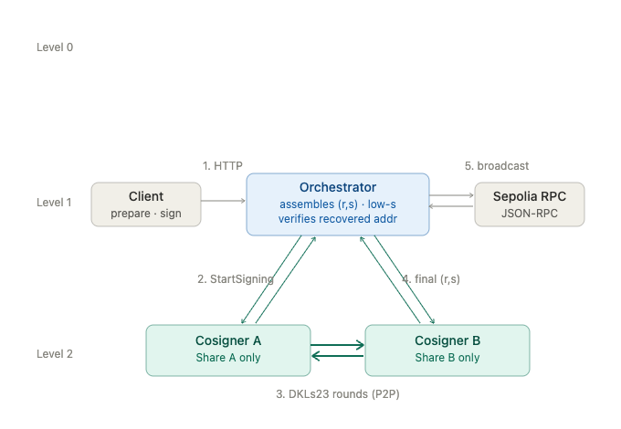

# 2-of-3 MPC Signer – DKLs23

This repo showcases a t-of-n MPC signer, deployed as 2-of-3: two active
cosigners plus a cold recovery shard (cloud-hosted in production, online only
for DKG and recovery).

Prepares, signs, and broadcasts Ethereum transactions using threshold signatures (MPC).

## 1. Architecture

### 1.1 Component scope

The Orchestrator holds no shares; each cosigner holds exactly one.

External actors (calls to the public API, and the Sepolia RPC node) are not components.

.png)

### 1.2 DKG workflow

A one-time ceremony. The Orchestrator triggers DKG on all n cosigners (all must be online). Then the cosigners run the DKLs23 DKG rounds directly P2P and each persists its own share.

The derived address is reported back and independently verified by the operator.

.png)

### 1.3 Signing and broadcast workflow

The runtime path. The client calls the Orchestrator (sovra-api) to prepare and sign. Then the Orchestrator selects t ready cosigners (config preference order, cold party last) and triggers signing on exactly those.

The cosigners run the DKLs23 rounds directly P2P and return the final signature.

The Orchestrator assembles and verifies the signature, then broadcasts to Sepolia.

---

## 2. Public HTTP API

Three transaction-lifecycle endpoints (`prepare`, `sign`, `broadcast`), plus operator endpoints for DKG.

### `POST /v1/prepare`

Build an unsigned EIP-1559 transaction from intent.
Request: `{ to, value, data? }` (`data` defaults to `0x`).
`from` is always the active DKG address (`409` if DKG has not run).

Response: `{ from, unsigned_transaction, tx_digest }`.

### `POST /v1/dkg`

Operator endpoint. Runs the one-time DKG ceremony, persists one shard per party,
and returns the derived signer address.
Response: `{ address }`. A second call returns `409` — no key rotation in the PoC.

### `GET /v1/dkg`

Returns the active signer address (`{ address }`, or `404` if DKG has not run),
so the operator can independently verify the derived address.

### `POST /v1/sign`

Execute signing across the selected t cosigners over the supplied unsigned transaction.
Request: `{ unsigned_transaction }` — the `0x02…`-prefixed bytes from `prepare`

Response: `{ signed_transaction, signature: { r, s, y_parity }, recovered_address, tx_digest }`.

### `POST /v1/broadcast`

Submit the signed transaction to Sepolia and wait up to 30 seconds for a receipt.

---

## Goal of this repository:

- DKG (Distributed Key Generation) sets up 3 shards (2-of-3) - DKLs23 DKG
- Take a tx hash to sign a Sepolia transaction - DKLs23 rounds
- Broadcast it – using a public RPC
- Be verifiable on Etherscan
- Shards on different machines: one on a raspberry pi, one local, and the cold recovery shard hosted on cloud (for demo purposes)

## Out of scope, for now

These are deliberate deferrals, not gaps:

- API authentication, authorization, rate limiting
- Share encryption at rest (filesystem permissions only for PoC)
- TLS certificate lifecycle (rotation, revocation)
- Concurrent signing sessions (global lock for PoC)
- Observability backend (local JSON logs only)
- Multi-chain support (Sepolia only)
- Automated backup and restore (manual archive only)
- Plain shard rotation without loss and quorum changes (`quorum_change`) — recovery of a lost shard IS supported (`POST /v1/recover`, see RUN.md)

/!\ This repo is for demo purposes only.     

It uses the [silence-laboratories DKLs23](https://github.com/silence-laboratories/dkls23) as MPC TSS crypto implementation that has been audited but that is under commercial license.
