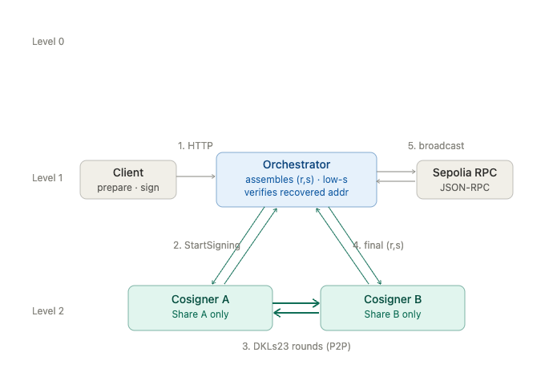

# Architecture

## 1. Architecture diagrams

Three single-purpose diagrams:
- The first shows component scope and ownership (no flow). 
- The second: the DKG workflow
- The third: Signing and broadcast workflow

In all three, the CLI only talks to the Orchestrator, and the Orchestrator is the only thing that reaches the cosigners.

### 1.1 Component scope

The Orchestrator holds no shares; each cosigner holds exactly one.

External actors (calls to the public API, and the Sepolia RPC node) are not components.

.png)

### 1.2 DKG workflow

A one-time ceremony. The Orchestrator triggers DKG on both cosigners. Then the cosigners run the DKLs23 DKG rounds directly P2P and each persists its own share.    

The derived address is reported back and independently verified by the operator.    

.png)

### 1.3 Signing and broadcast workflow

The runtime path. The client calls the Orchestrator to prepare and sign. Then the Orchestrator triggers signing on both cosigners.    

The cosigners run the DKLs23 rounds directly P2P and return the final signature.    

The Orchestrator assembles and verifies the signature, then broadcasts to Sepolia.



---

## 2. Public HTTP API

Three transaction-lifecycle endpoints (`prepare`, `sign`, `broadcast`), plus operator endpoints for DKG.

### `POST /v1/prepare`

Build an unsigned EIP-1559 transaction from intent.

### `POST /v1/sign`

Execute signing across both cosigners over the supplied unsigned transaction.

### `POST /v1/broadcast`

Submit the signed transaction to Sepolia and wait up to 30 seconds for a receipt.

---

## 3. Workspace structure

```
sovra-mpc-poc/
├── crates/
│   ├── sovra-api/           # Orchestrator (API Host) binary
│   ├── sovra-cosigner/      # Cosigner binary (used for both A and B)
│   ├── sovra-cli/           # Operator CLI (talks to Orchestrator only)
│   ├── sovra-types/         # Shared identifiers, session states, errors
│   ├── sovra-ipc/           # gRPC service definitions and mTLS transport
│   ├── sovra-mpc/           # ThresholdSigner trait
│   ├── sovra-mpc-dkls23-silence/  # Silence Labs DKLs23 adapter
│   ├── sovra-eth/           # Tx prep, encoding, verification, broadcast
│   ├── sovra-state/         # Filesystem repositories
│   └── sovra-observability/ # Structured logging
├── config/
├── data/        # Runtime state. Gitignored.
├── certs/       # Local mTLS certs. Gitignored.
├── docs/
└── scripts/
```