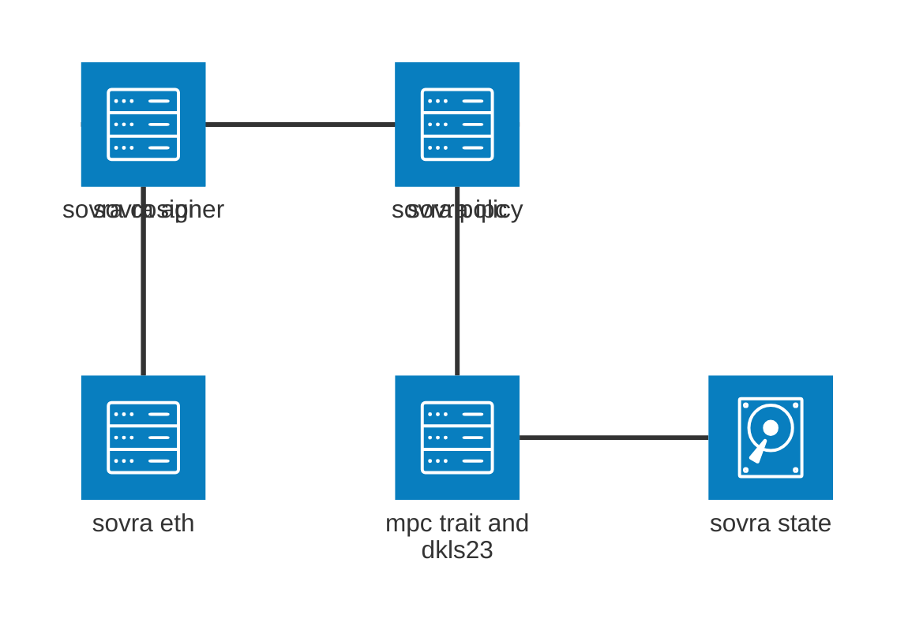
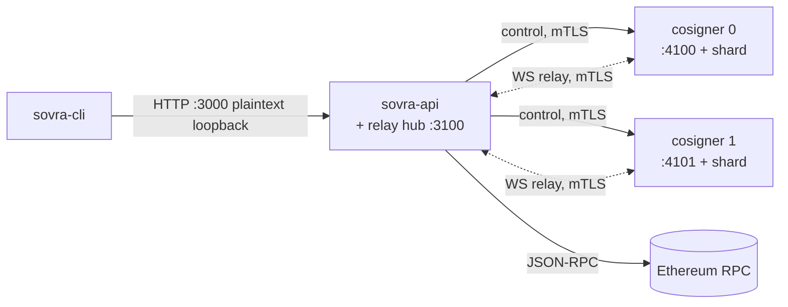
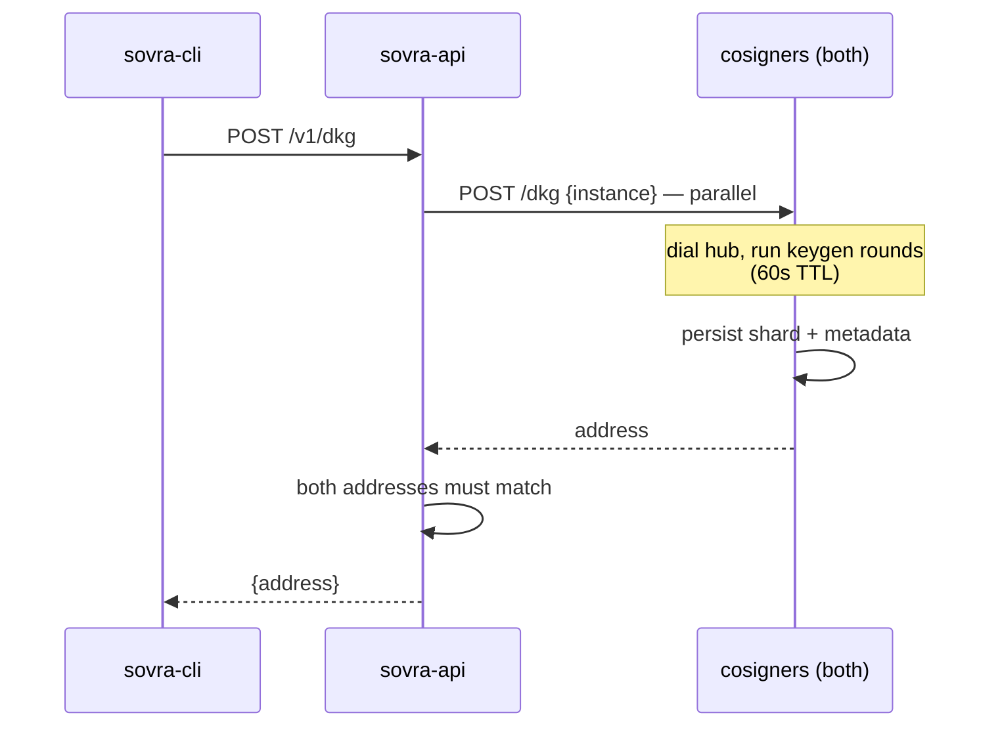
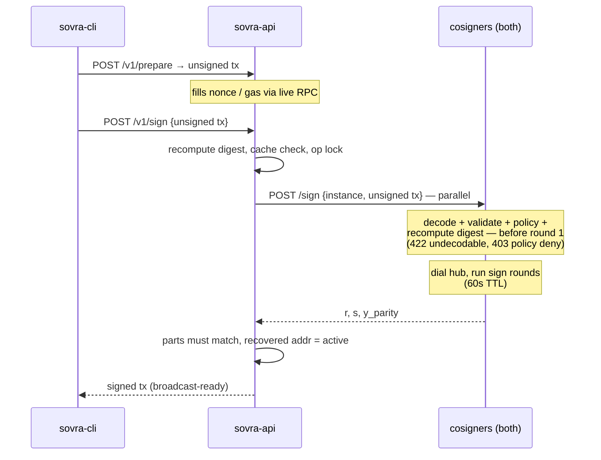

# SOVRA — Process & Crate Architecture

t-of-n MPC (DKLs23) Ethereum transaction signer, deployed as **2-of-3**: one
orchestrator (`sovra-api`), three cosigners (`sovra-cosigner`) of which
cosigner 2 is the **cold recovery party** (online for DKG and recovery only),
driven by a thin HTTP CLI. Nothing spawns anything — all are started
independently, cosigners first (see `RUN.md`). Every cosigner pins the full
roster (all parties' ed25519 verifying keys, index = party id) plus the
threshold; the orchestrator knows only `[{party_id, url}]` in signing
preference order — it never learns MPC identities.

## 1. Crates

| Crate | Role |
|---|---|
| `sovra-api` (bin) | Orchestrator: public API, hosts the relay hub, finalizes txs |
| `sovra-cosigner` (bin) | One MPC party: identity, key shard, runs its protocol half |
| `sovra-cli` (bin) | `dkg` / `prepare` / `sign` over HTTP; no state, no deps on other crates |
| `sovra-ipc` | Transport: WS relay plane + HTTP control plane |
| `sovra-mpc` | The `MpcBackend` trait seam |
| `sovra-mpc-dkls23-silence` | DKLs23 implementation (Silence Labs `sl-dkls23`) |
| `sovra-eth` | EIP-1559 prepare / encode / finalize; no key material. RPC stack behind the default-on `rpc` feature — cosigners build the lean core only |
| `sovra-policy` | Pure per-cosigner signing policy: decoded tx view in, verdict out; no I/O |
| `sovra-state` | Per-party shard + metadata store on disk |
| `sovra-types` | Shared plain types |
| `sovra-observability` | Tracing setup |
| `xtask` | Dev orchestration: `cargo xtask up/down/reset`; not shipped |

## 2. Crate layering

Only load-bearing edges; everything also uses `sovra-types`/`-observability`.

The `cosigner → eth` and `cosigner → policy` edges are the M7 structural
change: enforcement moved to the party holding the shard, so the cosigner now
decodes what it signs (lean `sovra-eth`, no RPC stack) and consults its own
policy before any MPC round.

## 3. Runtime topology

Two planes: **control** (HTTPS/JSON, api commands the cosigners and
cross-checks their answers; DKG goes to all n after a `GET /roster`
consistency pre-flight, sign goes to the first t *ready* parties in
preference order — selected before asking, never re-selected on a veto) and
**relay** (WebSocket over TLS, opaque MPC
round messages through the hub *inside* the api process). Both internal
planes are **mTLS against the project CA** (`certs/`, seeded by `cargo xtask
certs`); the CLI-facing :3000 is plaintext loopback by decision — the custody
boundary is the cosigner, not the orchestrator. Beyond the diagrams below,
cosigners also expose `GET /identity` and `GET /health`, and the api exposes
`GET /v1/dkg` (returns the active signer address).

## 4. DKG (one-time)

## 5. Sign

A policy deny surfaces on `/v1/sign` as **403** with every veto attributed
(`{"error":"policy denied","vetoes":[{"party":1,"reason":"…"}]}`). Any
*selected* cosigner alone blocks — a veto is final and never triggers
failover to another party (outcome-keyed re-selection would be a policy
bypass); when policies differ, the allowing party waits out its ttl before
the 403 lands — by then every op lock is free again. Corollary: the effective
policy is what any t parties jointly allow, so all n policy files (including
the cold party's) must carry the same baseline.

## 6. Rules that hold everywhere

- **Startup recovery**: api probes every cosigner's `GET /signer`; needs at
  least t reachable (the cold party may be down) and all reachable parties in
  agreement — all 404 → fresh, same address → active, any disagreement →
  refuses to start.
- **One MPC op at a time**: api and cosigners `try_lock`; busy = 409, never
  queued. Sign is idempotent per digest (in-memory cache).
- **Timeouts**: cosigner MPC run 60s (`ttl_secs`) < api per-cosigner HTTP 90s
  — a live run is never cut mid-flight.
- **Never trust the caller**: api recomputes the digest from tx bytes;
  finalize recovers the signer and requires it to equal the active address.
- **Cosigners never sign opaque digests**: the wire carries the unsigned tx
  preimage; each cosigner decodes, validates, policy-checks, and re-derives
  the digest at the shard, fail-closed (no policy file → refuse to start),
  before any MPC message. Api-side checks are defense in depth, not the
  security boundary.
- **Every internal socket is mTLS**: servers require a leaf signed by the
  project CA, clients pin that CA (never WebPKI) and present their own leaf —
  TLS material missing at startup → refuse to start, plaintext schemes
  (`http`/`ws`) for internal peers → refused as config errors. The ed25519
  party keys keep authenticating the cosigners *inside* the MPC; mTLS
  authenticates the transport and the requester — complementary layers.
- **Key material**: only the two shards, one per cosigner, useless alone. The
  api, CLI, and hub never see keys; the hub shuttles opaque frames only.

## 7. Design rationale (why `sovra-ipc` looks like this)

The requirement chain: *no single machine/process may sign alone* (custody) →
two processes that must cooperate → an IPC layer. *Demo on one laptop today,
cosigner on separate hardware later, no rewrite* → network protocols over
loopback, not pipes/Unix sockets — distributing becomes a config change.

The choices, condensed:

1. **Two planes, not one protocol.** Commands are request/response and
   human-readable → HTTP/JSON. MPC rounds are streaming, binary, opaque →
   WebSocket. One shape forced onto both gives polling hacks or unreadable
   control traffic.
2. **HTTP/JSON over gRPC.** Typed contracts weren't worth the protobuf
   toolchain and lost `curl`-debuggability for two internal endpoints.
   Revisit if the surface grows.
3. **The relay hub lives in the api and is dumb.** A fourth process is more
   ops for zero gain: the relay is untrusted by design. Authentication lives
   in the MPC setup messages (pinned ed25519 keys); compromising the hub
   yields denial of service, never a signature. It still requires client
   certs (M8): server-only TLS would be cryptographically sufficient, but
   the cert requirement closes the last unauthenticated port — a certless
   local process could otherwise spray junk frames at a live signing session
   — and one uniform posture ("every internal socket is mTLS") is simpler to
   reason about than one special case.
4. **Transport hides behind `MpcBackend`.** Handlers call `backend.sign()`;
   tests inject the in-process backend, production injects `RemoteBackend`.
   This seam pinned the HTTP contract in tests before the split existed.
5. **Paranoid orchestration.** Both cosigners get every command and must
   independently agree (`PartyMismatch` otherwise). Layered timeouts (60s MPC
   run < 90s HTTP) mean a live run is never cut from outside, but a dead peer
   can't wedge anyone — the 60s timeout is also what frees the op lock.
6. **Consciously deferred:** schema'd contracts; **public-API TLS** (:3000
   is the human/CLI edge on loopback — TLS there means cert distribution to
   every CLI user for zero custody gain; revisit if :3000 ever leaves the
   box); **role/party binding from the cert CN** — today any project-CA leaf
   is authorized on both planes, which is fine while cosigners are trusted
   parties, but t-of-n with mutually-distrusting operators wants the cosigner
   to accept only CN `sovra-orchestrator` on `/sign` (the CN already encodes
   role+party, so this is a connect-info extractor, not a re-issuance);
   **cert rotation/expiry** (leaves are 2-year; rotation is
   `rm certs/<name>.*.pem && cargo xtask certs`, no automation yet).
